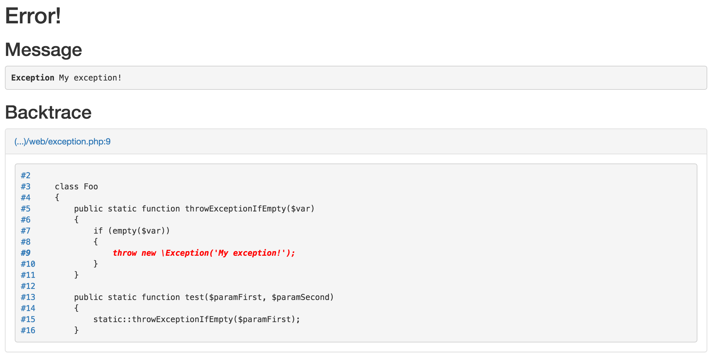
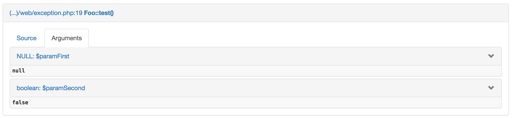

[](https://travis-ci.org/bkrukowski/error-dumper)
[](https://coveralls.io/github/bkrukowski/error-dumper?branch=master)
[](https://www.codacy.com/app/bartlomiej-krukowski/error-dumper?utm_source=github.com&amp;utm_medium=referral&amp;utm_content=bkrukowski/error-dumper&amp;utm_campaign=Badge_Grade)

# Pretty error dumper for PHP

**ErrorDumper** *has been moved to* [awesomite/error-dumper](https://github.com/awesomite/error-dumper), please use new repository.

## Requirements

* PHP >= 5.3 (also 7.0 is supported)
* no dependencies
* for nicer dump of variables you can add **symfony/var-dumper** to project

## Tests

[100% code coverage](https://coveralls.io/github/bkrukowski/error-dumper) with PHPUnit.

## Installation

### If you use composer

Add **bkrukowski/error-dumper** to dependencies.

### In other cases

Add below code to project:

```php
$pathToLib = 'here put path to error-dumper library';
include $pathToLib . 'src' . DIRECTORY_SEPARATOR . 'autoload.inc.php';
```

## Usage

**[Unsafe]** Below code is enough:

```php
\ErrorDumper\Magic::registerErrorDumper();
```

**[Safe]** But you should write something like this (because **all variables like credentials are visible**, when exception or error occur)

```php
if ($isInTestEnvironment)
{
    \ErrorDumper\Magic::registerErrorDumper();
}
else
{
    \ErrorDumper\Magic::registerErrorCallback(function ($e) {
        /** @var \Exception|\Throwable $e */
        // save error somewhere, for example:
        // $output = \ErrorDumper\Magic::exportExceptionToLightHtml($exception);
        // \Foo\MyErrorStorage::addHtmlError($output);
        exit(1);
    });
}
```

## Editors

Numbers of lines and names of files are clickable, but you have to set proper editor. Default editor is PhpStorm. If you use something else, put edtor object as argument in `registerErrorDumper` method.

```php
\ErrorDumper\Magic::registerErrorDumper(new \ErrorDumper\Editors\MacVim());
```

### Supported editors

* MacVim
* PhpStorm
* TextMate

## Snapshots

Using below code, you can save exception somewhere and display it later:

```php
$output = \ErrorDumper\Magic::exportExceptionToLightHtml($exception);
```

### Adding custom information to snapshots

From version 2.3.0 there is special constant `ErrorDumper\Dumpers\Html::TAG_UNDER_TITLE`. You can put under title whatever you want using `str_replace` function.

## Handle only exceptions

You can choose type of errors to handling. Methods

* `ErrorDumper\Magic::registerErrorDumper`
* `ErrorDumper\Magic::registerErrorCallback`
* `ErrorDumper\Handlers\RegisterErrorHandler::register`

have optional argument `$errorTypes`, default is equal `ErrorDumper\Handlers\RegisterErrorHandler::TYPE_ALL`.
This value is equal result of binary multiplication of constants `ErrorDumper\Handlers\RegisterErrorHandler::TYPE_*`.
If you want handle only errors, you should put here `ErrorDumper\Handlers\RegisterErrorHandler::TYPE_ERRORS | ErrorDumper\Handlers\RegisterErrorHandler::TYPE_SHUTDOWN_ERRORS`.

## Preview

### Error



### Arguments


